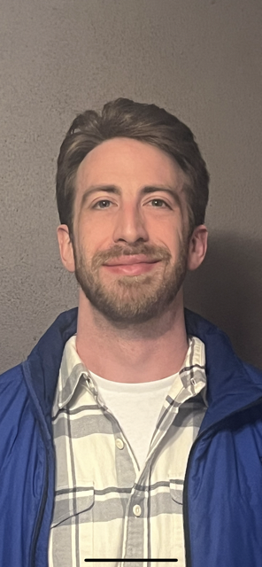

# The best course at New Paltz! 
## web-dev-spring2023

### Thomas Coffey

    

      
	Prior to attending SUNY New Paltz I had absolutely no computer experience. I worked as a restaurant manager, and my boss who owned the restaurant previously worked as a programmer so I thought it would be a good career path to try to get into. I love the challenge for learning new things and quickly fell in love with Computer Science. The classes I have taken so far include CS1, CS2, CS3, Object Oriented Programming, and Assembly Language and Computer Architecture. I received A’s in all these courses. In addition, I have made it a point to continue learning the field outside of the curriculum. In my spare time I have learned how to use Python, as well as learning and applying algorithms to solve problems that I could potentially get during future technical interviews. I completed a few small projects, games like “snake” and “connect 4” which I wrote in Python.  I am currently in the process of applying for summer internships. 
	
    I am very excited about taking this course because it is in a realm of computer science in which I know very little about. I have very little knowledge of any web programming, and I am aware of how important these skills are in the real world. Creating a full stack application will be a real challenge, but the skills I will learn and the potential to add this application to my portfolio will be a huge motivation. Hopefully I will learn what it takes to create an application at every step of production.
